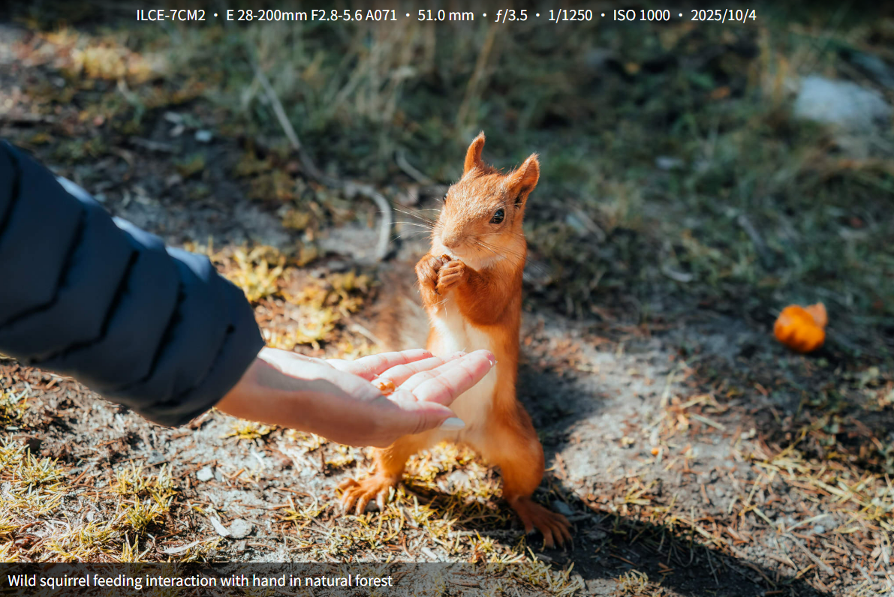

# Photosuite

[官方网站](https://photosuite.lhasa.icu) • [最新版本](https://github.com/achuanya/photosuite/releases) • [更新日志](https://github.com/achuanya/photosuite/main/Changelog.md) • [English](./README.md)

Photosuite 是一款简单易用但功能丰富的图像插件，它将灯箱、EXIF、路径补全等功能，模块化整合在一个零配置的插件中。开箱即用，无需繁琐的配置，一行代码即可让您的图片焕然一新！

## 特性

*   **灯箱**：定制并集成 GLightbox 灯箱，更简约、更实用
*   **EXIF**：集成 exiftool-vendored.js 执行快、覆盖广
*   **路径**：只需要插入文件名，自动补全绝对路径
*   **标题**：自动获取图片alt进行标题展示
*   **性能**：纯静态，功能模块化，按需加载
*   **零配置启动**：默认配置即可满足绝大多数需求，同时也提供丰富的选项供深度定制

## 安装

```bash
pnpm add photosuite
# 或
npm install photosuite
# 或
yarn add photosuite
```

## 快速开始

> **注意**：`scope` 是唯一的**必填项**，用于指定插件生效的范围，避免影响网站其他部分。

```javascript
import { defineConfig } from 'astro/config';
import photosuite from 'photosuite';

export default defineConfig({
  integrations: [
    photosuite({
      // [必填] 指定生效范围的 CSS 选择器
      // 建议指定为您的文章容器，可包含多个选择器，用逗号分隔
      scope: '#main',
    })
  ]
});
```

配置完成后，Photosuite 会自动处理您 Markdown/MDX 中的所有图片。

## 功能详解与配置

### 1. 路径解析

在写博客时，图片路径往往很麻烦。Photosuite 提供了灵活的路径解析策略，您可以根据实际情况进行配置

**场景 A：所有图片都在一个域名下**

```javascript
photosuite({
  scope: '#main',
  imageBase: 'https://cdn.example.com/images/',
})
```

**Markdown 写法：**
```markdown
 
<!-- 最终解析为: https://cdn.example.com/images/photo.jpg -->
```

**场景 B：每篇文章有独立的图片目录（默认）**

您可以在 Frontmatter 中指定目录名：

```yaml
---
title: 我的第一次 GitHub PR
imageDir: "2025-11-26-my-first-github-pr"
---

 
<!-- 最终解析为: https://cdn.example.com/images/2025-11-26-my-first-github-pr/photo.jpg -->
```

**场景 C：以文件名为目录**

```javascript
photosuite({
  scope: '#main',
  imageBase: 'https://cdn.example.com/',
  fileDir: true, // 开启此选项
})
```

如果您的文章文件名是 `2025-11-26-my-first-github-pr.md`，图片路径会自动解析为：

`https://cdn.example.com/images/2025-11-26-my-first-github-pr/photo.jpg`

### 2. EXIF 信息展示

Photosuite 使用 `exiftool-vendored.js` 在构建时提取信息。

**默认配置：**
默认显示：相机型号、镜头型号、焦距、光圈、快门速度、ISO、拍摄时间。

> NIKON Z 30 · NIKKOR Z DX 16-50mm f/3.5-6.3 VR · 20.5 mm · ƒ/3.8 · 1/15 · ISO 1000 · 2025/12/9

**自定义配置：**

```javascript
photosuite({
  // ...
  exif: {
    enabled: true,
    // 自定义显示字段：焦距、光圈、快门速度、ISO
    fields: ['FocalLength', 'FNumber', 'ExposureTime', 'ISO'], 
    // 自定义分隔符
    separator: ' · ' 
  }
})
```

### 3. 灯箱与标题

GLightbox 经过我定制后，与官方版本有些许差异

支持原生配置，可参考：[GLightbox](https://github.com/achuanya/glightbox)  

```javascript
photosuite({
  // ...
  // 关闭灯箱功能
  glightbox: false, 
  
  // 关闭图片标题
  imageAlts: false,

  // GLightbox 原生配置传递
  glightboxOptions: {
    loop: true,
    zoomable: true,
  }
})
```

## 完整配置参考

### 参数列表

| 参数 | 类型 | 必填 | 默认值 | 说明 |
| :--- | :--- | :---: | :--- | :--- |
| `scope` | `string` | ✅ | - | **生效范围**。CSS 选择器，仅处理该容器内的图片，可包含多个选择器，用逗号分隔 |
| `selector` | `string` | ❌ | `"a.glightbox"` | **图片选择器**。指定哪些图片需要启用灯箱效果 |
| `imageBase` | `string` | ❌ | - | **图片基础 URL**。用于拼接相对路径的前缀 |
| `imageDir` | `string` | ❌ | `"imageDir"` | **目录字段名**。在 Markdown Frontmatter 中指定图片目录的字段名称 |
| `fileDir` | `boolean` | ❌ | `false` | **文件名归档**。是否自动使用 Markdown 文件名作为图片子目录 |
| `glightbox` | `boolean` | ❌ | `true` | **启用灯箱**。是否加载 GLightbox 模块 |
| `imageAlts` | `boolean` | ❌ | `true` | **启用标题**。是否将 `alt` 属性显示为图片标题 |
| `exif` | `boolean` \| `object` | ❌ | `true` | **启用 EXIF**。可通过 fields:[] 配置显示选项 |
| `glightboxOptions` | `object` | ❌ | - | **灯箱原生配置**。透传给 GLightbox 的配置项 |

### 全部配置代码示例

```javascript
photosuite({
  // ----------------
  // 必填项
  // ----------------
  scope: '#main', // 您的文章容器类名

  // ----------------
  // 选填项 (以下均为默认值)
  // ----------------
  
  // 基础设置
  selector: 'a.glightbox',
  
  // 路径解析
  imageBase: '', 
  imageDir: 'imageDir',
  fileDir: false,

  // 功能开关
  glightbox: true,
  imageAlts: true,
  
  // EXIF 详细配置
  exif: {
    enabled: true,
    fields: [
      'Model',            // 相机型号
      'LensModel',        // 镜头型号
      'FocalLength',      // 焦距
      'FNumber',          // 光圈
      'ExposureTime',     // 快门速度
      'ISO',              // 感光度
      'DateTimeOriginal'  // 拍摄时间
    ],
    separator: ' · '      // 分隔符
  },

  // GLightbox 原生配置
  glightboxOptions: {
    loop: true,
    touchNavigation: true,
    closeOnOutsideClick: true
  }
})
```

## 常见问题

**1.为什么 EXIF 信息没有显示？**
A: 请检查以下几点：

1. 图片是否包含 EXIF 信息（某些压缩工具会去除 EXIF）
2. EXIF 信息至少有曝光三要素（焦距、光圈、快门速度）时，才会显示

**2.我想只在某些图片上使用 Photosuite，怎么办？**
A: 您可以通过 CSS 选择器精确控制范围（多个选择器用逗号分隔）例如，只在类名为 `'#main` 的元素内部生效：

```javascript
photosuite({
  scope: '#main',
  // ... 其他配置
})
```

## 贡献者们

一行代码，一个插件，对于独立博客而言，微不足道，如同尘埃。

但我们偏要在这片土壤中扎根，让灵魂安放，让思想站立！

[](https://github.com/achuanya/photosuite/graphs/contributors)

## 支持者们
[](https://github.com/achuanya/photosuite/stargazers)

## 开源许可协议

[GPL-3.0](./LICENSE)